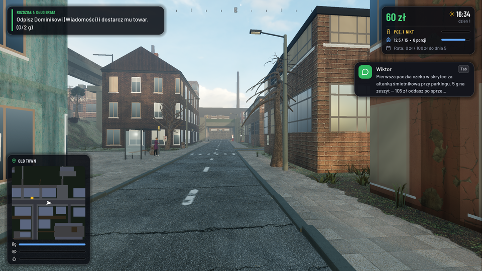
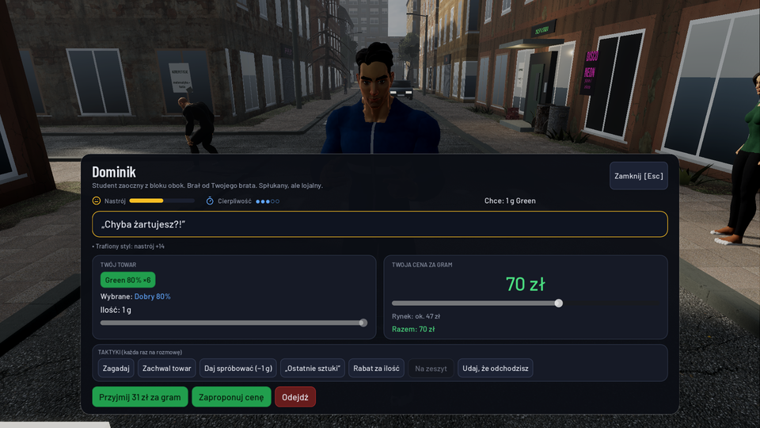
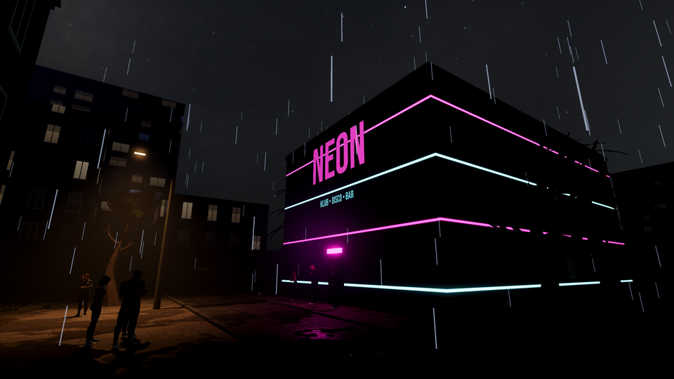
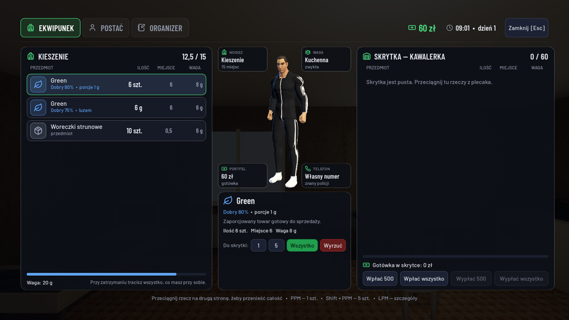

# Czarny Rynek

Gra testowa Piotra Piłki — symulator osiedlowego dilera w klimacie polskiego blokowiska (Godot 4, widok z pierwszej osoby).
Wszystkie postacie, miejsca i wydarzenia są fikcyjne. Gra nie zachęca do łamania prawa ani zażywania narkotyków.

▶ **Zwiastun:** [zwiastun/czarny-rynek-zwiastun-720p.mp4](zwiastun/czarny-rynek-zwiastun-720p.mp4)

| | |
|---|---|
|  |  |
|  |  |

## Jak uruchomić

**macOS:** kliknij dwukrotnie **`Uruchom Czarny Rynek.command`**. Potrzebny jest [Godot 4](https://godotengine.org/download)
(projekt powstał w wersji 4.7) w `/Applications/Godot.app`.

**Windows / Linux:** otwórz w Godocie plik `godot/project.godot` i naciśnij F5.

Pierwsze uruchomienie po pobraniu trwa dłużej — Godot musi zaimportować modele i tekstury (ok. 300 MB zasobów).

Gra startuje na pełnym ekranie (F11 przełącza okno). Jakość grafiki zmienisz w telefonie → Ustawienia.
Obraz 3D skaluje się automatycznie, żeby utrzymać ok. 60 kl./s na MacBooku z M2; interfejs zawsze jest ostry.

## O co chodzi

Brat zniknął i zostawił Ci kawalerkę oraz 25 000 zł długu u Wiktora. Wiktor daje towar na zeszyt i pierwszego klienta.
Resztę budujesz sam: klienci z polecenia, własna kryjówka, uprawa, kolejne towary (Green → Speed → Blue → Snow).
Raty rosną co cztery dni — trzy wpadki i koniec gry. Spłata całości zajmuje ok. 45 dni gry (1 godzina gry = 60 s).

- **Towar**: zamawiasz w telefonie (Hurt), odbierasz ze skrytki w mieście, porcjujesz na wadze, możesz rozrobić
  (większa waga, niższa czystość — doświadczeni klienci rozpoznają mieszankę i odmówią).
- **Klienci**: piszą SMS-y z godziną i miejscem. Odpowiadasz: Zgoda / Negocjuj / Zmień godzinę / Anuluj.
  Klient wychodzi z domu i idzie na miejsce. Na spotkaniu wybierasz ton rozmowy i taktyki.
- **Ekwipunek** (I): rzeczy mają rozmiar i wagę, układają się w stosy; przeciągasz je między plecakiem a skrytką.
- **Policja**: patrole piesze i radiowóz, gorąco w dzielnicach, śledztwo. W pościgu przytrzymaj X, żeby wyrzucić towar.
- **Kryjówki**: garaż i piwnica do kupienia; meblujesz je sam (B) — stół z wagą, regały, namiot uprawowy.

## Sterowanie

| Klawisz | Działanie |
|---|---|
| WASD, mysz | ruch i rozglądanie |
| Shift | sprint |
| E | interakcja (przytrzymaj przy skrytce) |
| Tab | telefon |
| I | ekwipunek |
| N / Q | trasa do celu / następny cel |
| B / R | meblowanie kryjówki / obrót mebla |
| F | latarka |
| X (przytrzymaj) | wyrzuć towar |
| M | dźwięk |
| F11 | pełny ekran |
| Esc | pauza |

## Muzyka w klubie

Klub Neon gra wbudowany, oryginalny bit. Żeby leciała Twoja muzyka, wrzuć własne pliki MP3 do `godot/muzyka/`.

## Co jest w repozytorium

- `godot/` — **główna gra** (Godot 4; skrypty w `scripts/`, zasoby w `assets/`).
- `game/` — starsza wersja przeglądarkowa (Three.js), od której projekt się zaczął. Uruchomienie: `game/Uruchom.command`
  albo `python3 game/serve.py`. Ma własny opis w `game/README.md`.
- `zwiastun/` — zwiastun gry (720p).
- `screenshots/` — zrzuty ekranu.
- `LICENCJE.md` — autorzy i licencje użytych zasobów.

## Dla ciekawych: narzędzia

Wszystko uruchamia się z folderu `godot/`:

- `./tools/runtest.sh 90` — automatyczny test rozgrywki (bez okna i dźwięku).
- `./tools/runtest.sh 240 --sim=48 --runs=3 --lazy=0.35` — symulacja ekonomii: bot gra 48 dni i wypisuje bilans.
- `./shot.sh nazwa --autostart --loc=out --hour=18` — zrzut ekranu z gry (trafia do folderu tymczasowego).
- `./tools/trailer.sh <folder>` — nagranie klatek zwiastuna; potem `python3 tools/soundtrack.py` i `swift tools/encode.swift`.
