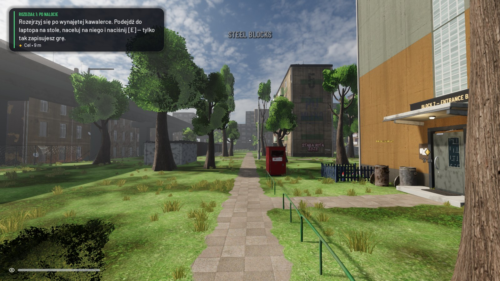
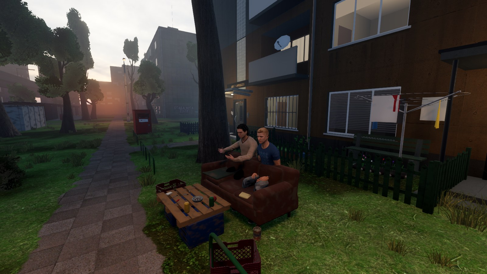
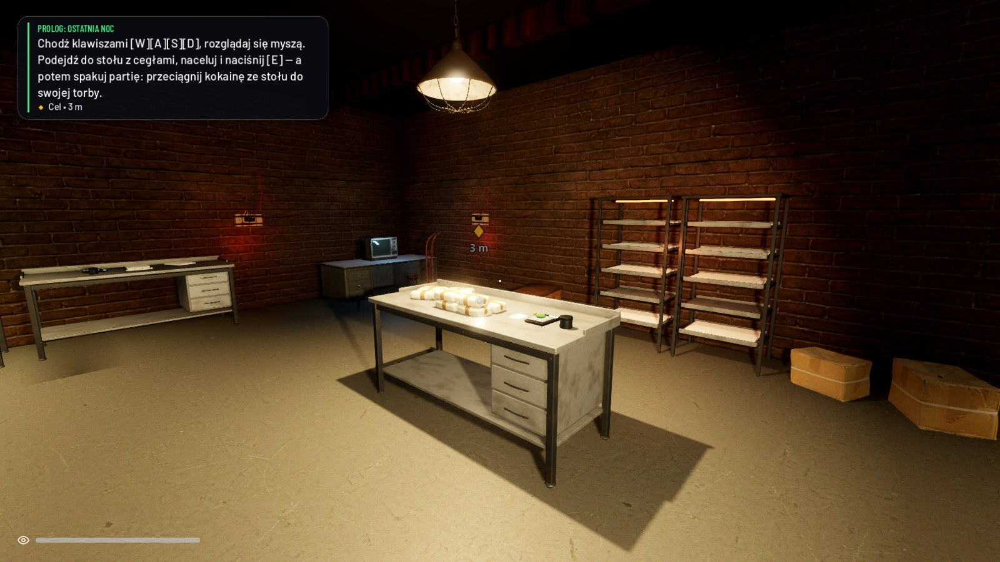
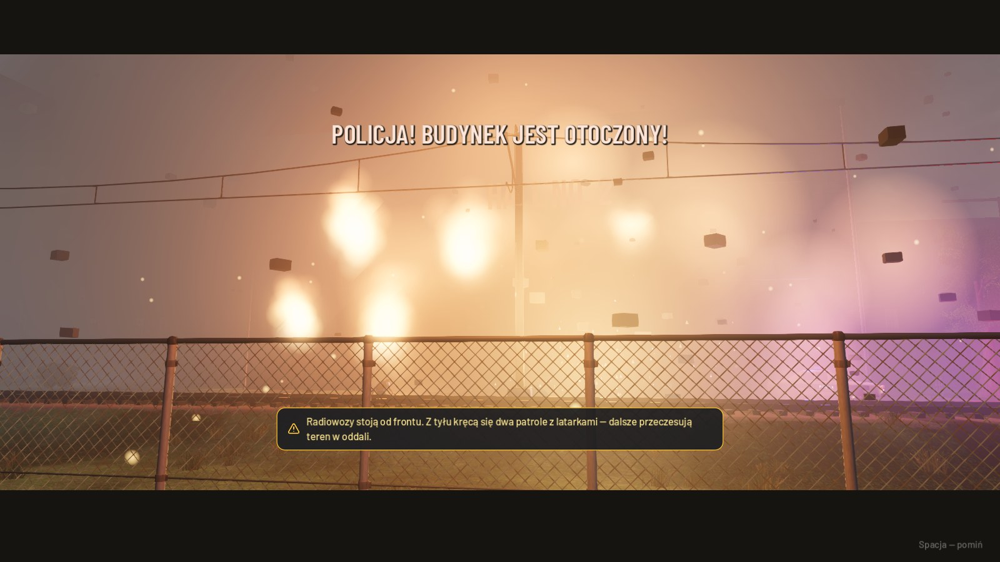
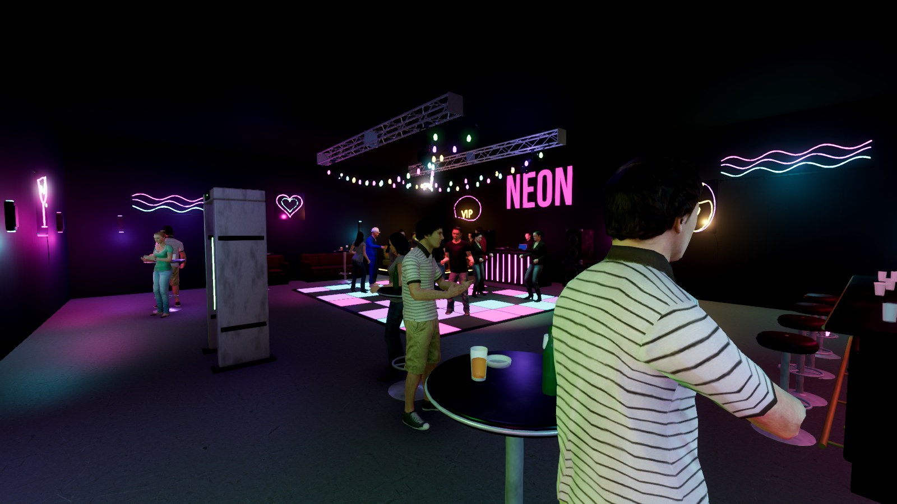
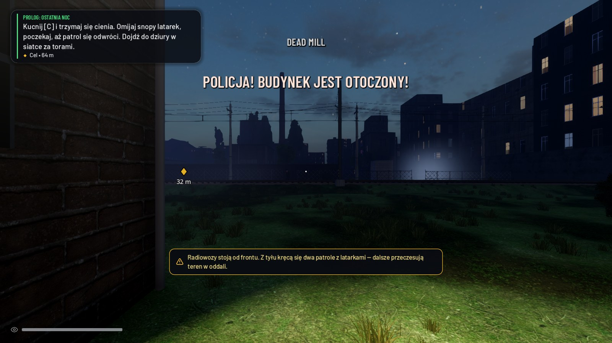
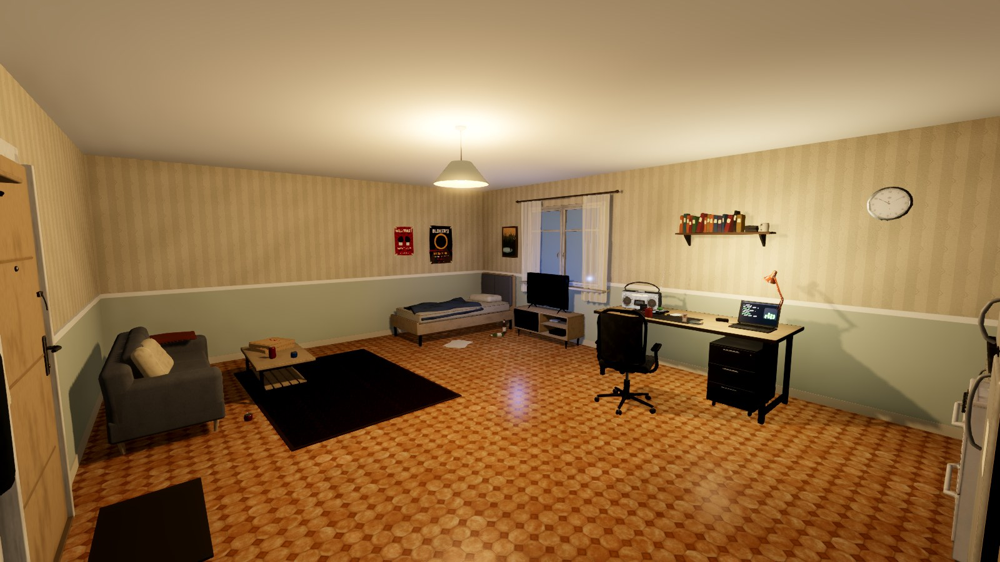
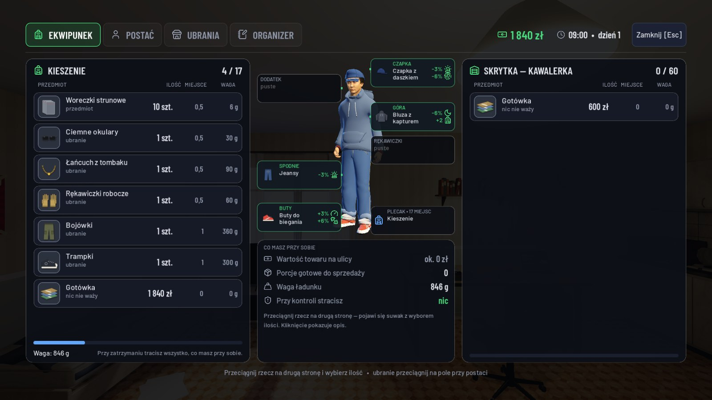
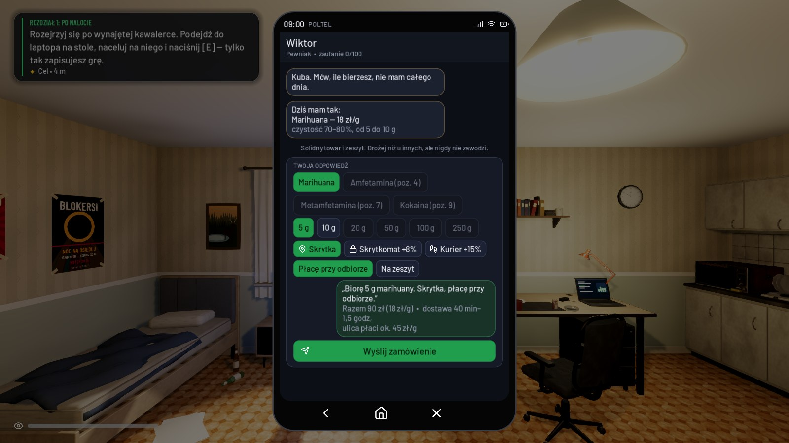
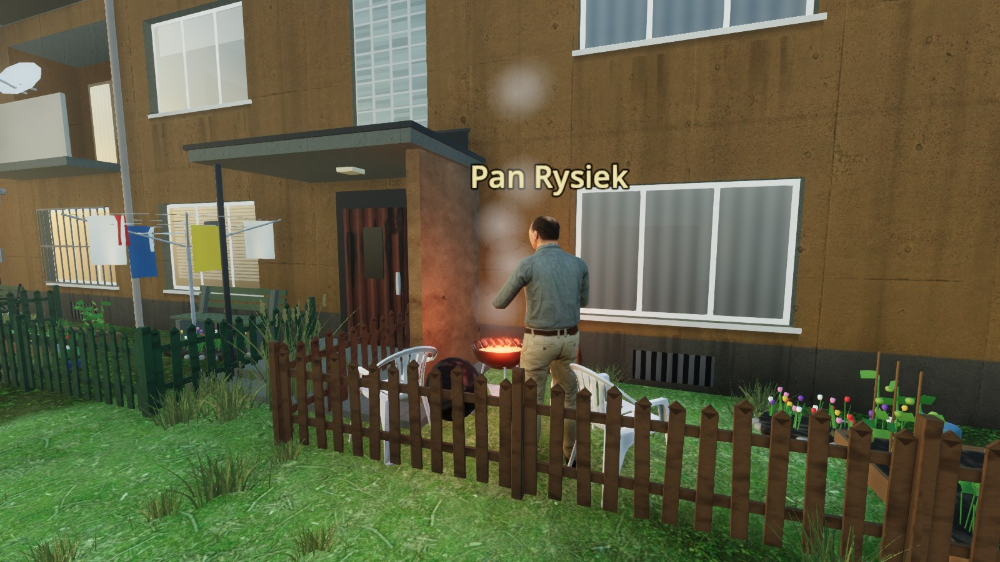

# Czarny Rynek

Gra testowa Piotra Piłki — symulator osiedlowego dilera w klimacie polskiego blokowiska (Godot 4, widok z pierwszej osoby).
Wszystkie postacie, miejsca i wydarzenia są fikcyjne. Gra nie zachęca do łamania prawa ani zażywania narkotyków.

▶ **Zwiastun:** [zwiastun/czarny-rynek-zwiastun-720p.mp4](zwiastun/czarny-rynek-zwiastun-720p.mp4)

| | |
|---|---|
|  |  |
|  |  |
|  |  |
|  |  |
|  |  |

## Jak uruchomić

**macOS:** kliknij dwukrotnie **`Uruchom Czarny Rynek.command`**. Potrzebny jest [Godot 4](https://godotengine.org/download)
(projekt powstał w wersji 4.7) w `/Applications/Godot.app`.

**Windows / Linux:** otwórz w Godocie plik `godot/project.godot` i naciśnij F5.

Pierwsze uruchomienie po pobraniu trwa dłużej — Godot musi zaimportować modele i tekstury (ok. 300 MB zasobów).

Gra startuje na pełnym ekranie (F11 przełącza okno). Jakość grafiki zmienisz w telefonie → Ustawienia.
Obraz 3D skaluje się automatycznie, żeby utrzymać ok. 60 kl./s na MacBooku z M2; interfejs zawsze jest ostry.

## O co chodzi

Po nalocie na laboratorium w Starej Hucie i zasadzce za garażami zostajesz z niczym. Wiktor nie ma do Ciebie żalu —
bierze Cię do swojej ekipy na najniższy szczebel, jako chłopaka od wszystkiego: daje towar na zeszyt i pierwszych klientów.
Resztę budujesz sam: klienci z polecenia, własna kryjówka, uprawa, kolejne towary (marihuana → amfetamina → metamfetamina → kokaina).
Nie ma długu, odsetek ani kar za spóźnienie. To, co odnosisz Wiktorowi ponad zeszyt za towar, jest Twoim **wkładem**:
kolejne progi to awanse z nagrodą (Goniec — plecak, Detalista — większy zeszyt, Dealer — tańszy hurt, Zaufany — garaż
za pół ceny, Prawa ręka — jeszcze tańszy hurt), a kto trzyma tempo, dostaje premię. Przy 25 000 zł zostajesz wspólnikiem
(ok. 35–47 dni gry; 1 godzina gry = 60 s).

Nowa gra zaczyna się krótkim wstępem (zatrzymanie brata, „trzy tygodnie później”), a samouczek najpierw oprowadza
po kawalerce: zapis gry, skrytka, waga — dopiero potem Wiktor wysyła po pierwszą paczkę.

- **Towar**: piszesz do Wiktora — telefon obraca się na bok i pokazuje jego „sklep”: kafle z towarem, pole na liczbę gramów, koszyk.
  Towar jest zawsze czysty i idzie na zeszyt. Paczka czeka w skrytce oznaczonej małym znakiem sprejem (z czasem skrytki
  są coraz dalej). Skrytkę, paczkę pod drzwiami i rzeczy leżące na ziemi otwierasz jednym naciśnięciem E: zawartość widać
  po prawej stronie ekwipunku i przeciągasz do siebie to, co chcesz (jest też „Zabierz wszystko”). Na zeszyt idzie tylko to,
  co zabrałeś.
- **Waga**: porcjowanie nie ma trybów ani woreczków — liczy się waga. Kuchenna stoi w kawalerce od początku, lepsze
  (jubilerska, laboratoryjna, z dozownikiem) kupisz w lombardzie: każda następna jest szybsza i gubi mniej towaru.
  Stół roboczy widzi cały towar razem — luzem i w porcjach, z plecaka i ze skrytki; porcje można rozsypać z powrotem
  i domieszać. Mieszanka kosztuje tyle samo, ale klient może kręcić nosem albo odmówić.
- **Sprzęt i meble**: kupujesz w hurtowni budowlanej przy Hutniczej (szyld BUILDING SUPPLIES), rzeczy trafiają „na stan”,
  w kryjówce ustawiasz je klawiszem B i dopiero wtedy działają. Zdjęty mebel wraca na stan; w hurtowni odsprzedasz go za połowę ceny.
- **Skrzynka Wiktora**: gotówkę wrzucasz do skrzynki za pawilonem (zawsze w tym samym miejscu). Najpierw schodzi z niej
  zeszyt za towar, cała reszta idzie na Twój wkład i awanse (telefon → Portfel pokazuje szczeble i nagrody).
- **Klienci**: każdy odzywa się mniej więcej raz dziennie i od razu podaje sumę za całość. Odpowiadasz kaflami (klawisze 1–5):
  Zgoda / Negocjuj / Zmień godzinę / Inny towar / Anuluj. Negocjacja to jedna liczba — suma za całość — i cztery małe
  przyciski: −10 i −1 w lewo (taniej), +1 i +10 w prawo (drożej). Godzinę wskazujesz na tarczy zegara (tylko dziś);
  jeśli klientowi nie pasuje, sam proponuje porę obok. „Inny towar” proponuje zamianę na to, co masz zaporcjowane.
  Po potwierdzeniu klient jest na miejscu ok. godzinę później i czeka około 5 godzin — nie zraża się czekaniem,
  a jeśli zdążysz w godzinę od umówionej pory, jest wyraźnie zadowolony i łatwiej coś u niego ugrać.
  Na spotkaniu nie ma gadania: wybierasz porcję, ewentualnie zmieniasz sumę tymi samymi przyciskami i przytrzymujesz „Podaj towar”.
  Świat się wtedy nie zatrzymuje — pasek pokazuje, ilu ludzi patrzy i czy widzi Was patrol.
  „Zaraz wracam” zostawia klienta na miejscu, „Rezygnuję” odwołuje transakcję.
- **Ekwipunek** (I): rzeczy mają rozmiar i wagę, układają się w stosy. Przeciągasz je między plecakiem a skrytką,
  a ilość wybierasz suwakiem albo wpisujesz. Sztuki są całe, gramy liczone w połówkach.
- **Zapis gry**: tylko przy laptopie w kryjówce (w kawalerce stoi na stole; do garażu i piwnicy kupisz stolik z laptopem).
  Nie ma zapisów automatycznych — niezapisany postęp przepada.
- **Interakcje** (E): trzeba nacelować na drzwi, mebel albo osobę z bliska; celownik zmienia się wtedy w zielony pierścień.
- **Policja**: na początku prawie jej nie ma, z każdym tygodniem patroli przybywa; piesze patrole i radiowóz, gorąco w dzielnicach, śledztwo. Policjant widzi przed siebie i trochę na boki,
  nie za plecy (stożki widać na mapie). W pościgu przytrzymaj X, żeby wyrzucić towar.
- **Miasto**: GPS prowadzi ulicami i ścieżkami, ale w płotach są dziury — kto zna teren, pójdzie na skróty.
- **Kryjówki**: garaż i piwnica do kupienia; meblujesz je sam (B) — stół z wagą, regały, namiot uprawowy.

## Sterowanie

| Klawisz | Działanie |
|---|---|
| WASD, mysz | ruch i rozglądanie |
| Shift | sprint |
| E | interakcja z tym, na co celujesz (skrytki, paczki i rzeczy na ziemi otwierają ekwipunek) |
| Tab | telefon |
| I | ekwipunek |
| N / Q | trasa do celu / następny cel |
| B / R | meblowanie kryjówki / obrót mebla |
| F | latarka |
| X (przytrzymaj) | wyrzuć towar |
| M | dźwięk |
| F11 | pełny ekran |
| Esc | pauza |

## Muzyka w klubie

Klub Neon gra wbudowany, oryginalny bit. Żeby leciała Twoja muzyka, wrzuć własne pliki MP3 do `godot/muzyka/`.

## Co jest w repozytorium

- `godot/` — **główna gra** (Godot 4; skrypty w `scripts/`, zasoby w `assets/`).
- `game/` — starsza wersja przeglądarkowa (Three.js), od której projekt się zaczął. Uruchomienie: `game/Uruchom.command`
  albo `python3 game/serve.py`. Ma własny opis w `game/README.md`.
- `zwiastun/` — zwiastun gry (720p).
- `screenshots/` — zrzuty ekranu.
- `LICENCJE.md` — autorzy i licencje użytych zasobów.

## Dla ciekawych: narzędzia

Wszystko uruchamia się z folderu `godot/`:

- `./tools/runtest.sh 90` — automatyczny test rozgrywki (bez okna i dźwięku).
- `./tools/runtest.sh 240 --sim=48 --runs=3 --lazy=0.35` — symulacja ekonomii: bot gra 48 dni i wypisuje bilans.
- `./shot.sh nazwa --autostart --loc=out --hour=18` — zrzut ekranu z gry (trafia do folderu tymczasowego).
- `./tools/plan.sh plan.png` — plan miasta z góry (nawierzchnie, budynki, kolizje), bez otwierania okna.
- `./tools/widok.sh widok.png "x,z" kąt` — widok z oczu gracza bez okna: gra eksportuje wycinek świata, Blender go renderuje
  (`LUDZIE=1` dołącza postacie; `./tools/widok_pokoj.sh` robi to samo dla wnętrz).
- `./tools/uiaudit.sh` — przegląd układu wszystkich okien interfejsu (ucięty tekst, elementy poza ekranem), też bez okna.
- `Godot --headless --path . -- --autostart --test --przeglad` — lista rekwizytów, które wiszą, toną albo stoją w budynku.
- `./tools/trailer.sh <folder>` — nagranie klatek zwiastuna; potem `python3 tools/soundtrack.py` i `swift tools/encode.swift`.
